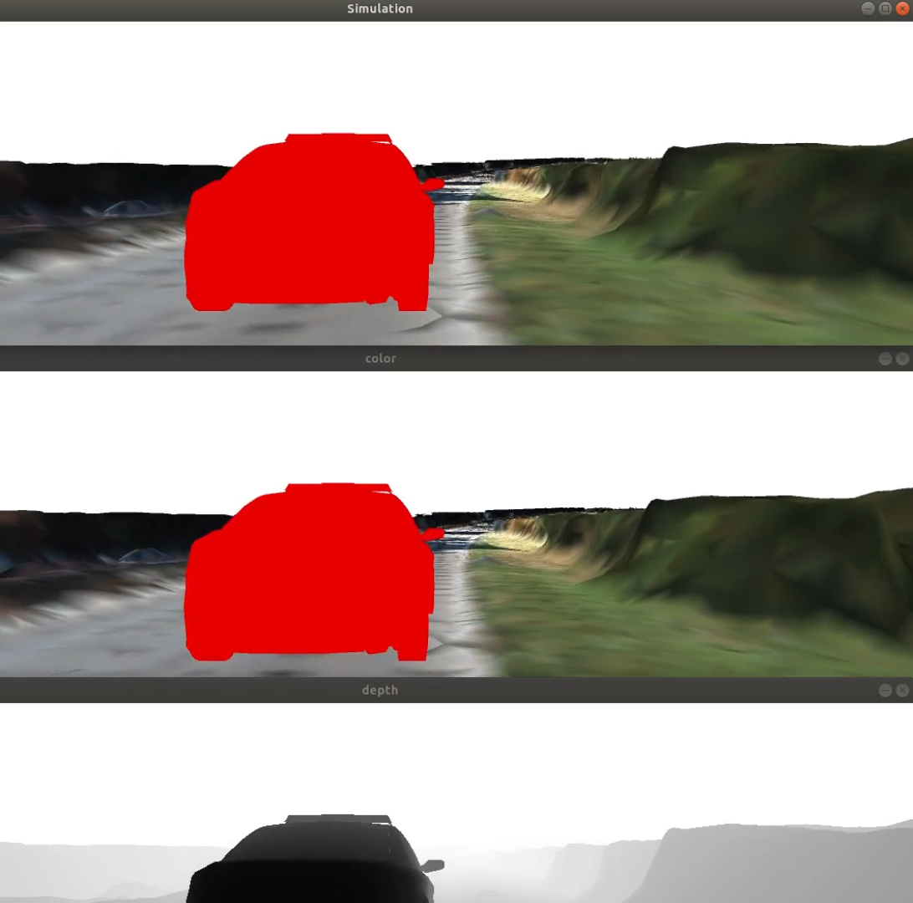
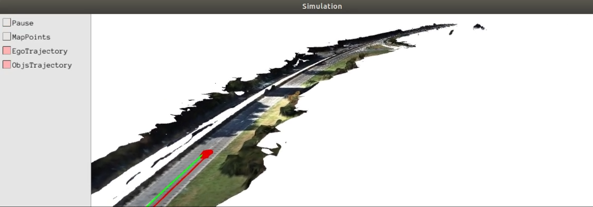

# Environment_Simulator
**Introduction**

A Simuple simulator for AR or AutomousDrive. We can get GT semantic mask, GT depth Image, GT Data Association, GT Dynamic Object Motion. 

**Videos:**

  

  

[Youtube](https://www.youtube.com/watch?v=OEHs7wQFf0Q)

[Youtube](https://www.youtube.com/watch?v=Tzo2XHA66Mw)
